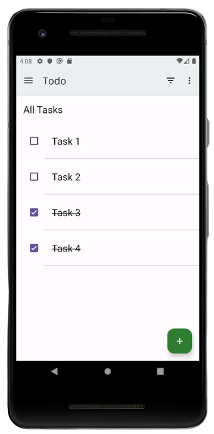

<h1 align="center">Todo App</h1>

Welcome to my first open-source project. The main purpose of this project is to help anyone who wants to learn how to build an app with a modern architecture and follow best practices according to the Android documentation.

### ✨ Contribution 
This repository is open to contributions, feel free to include your material directly by submitting a pull request. If you have any questions, suggestions, let's see the [issues](https://github.com/orauldev/todoapp/issues)

#### In this branch you'll find:
*   User Interface built with Views
*   A single-activity architecture, using Navigation Component.
*   A presentation layer that contains a View and a **ViewModel** per screen (or feature).
*   Reactive UIs using **[Flow](https://developer.android.com/kotlin/flow)** and **[coroutines](https://kotlinlang.org/docs/coroutines-overview.html)** for asynchronous operations.
*   A **data layer** with a repository and two data sources (local using Room and a fake remote).
*   Dependency injection using [Hilt](https://developer.android.com/training/dependency-injection/hilt-android).

This code contains implementation improvements by me and was inspired by [this sample](https://github.com/android/architecture-samples/tree/views-hilt)
